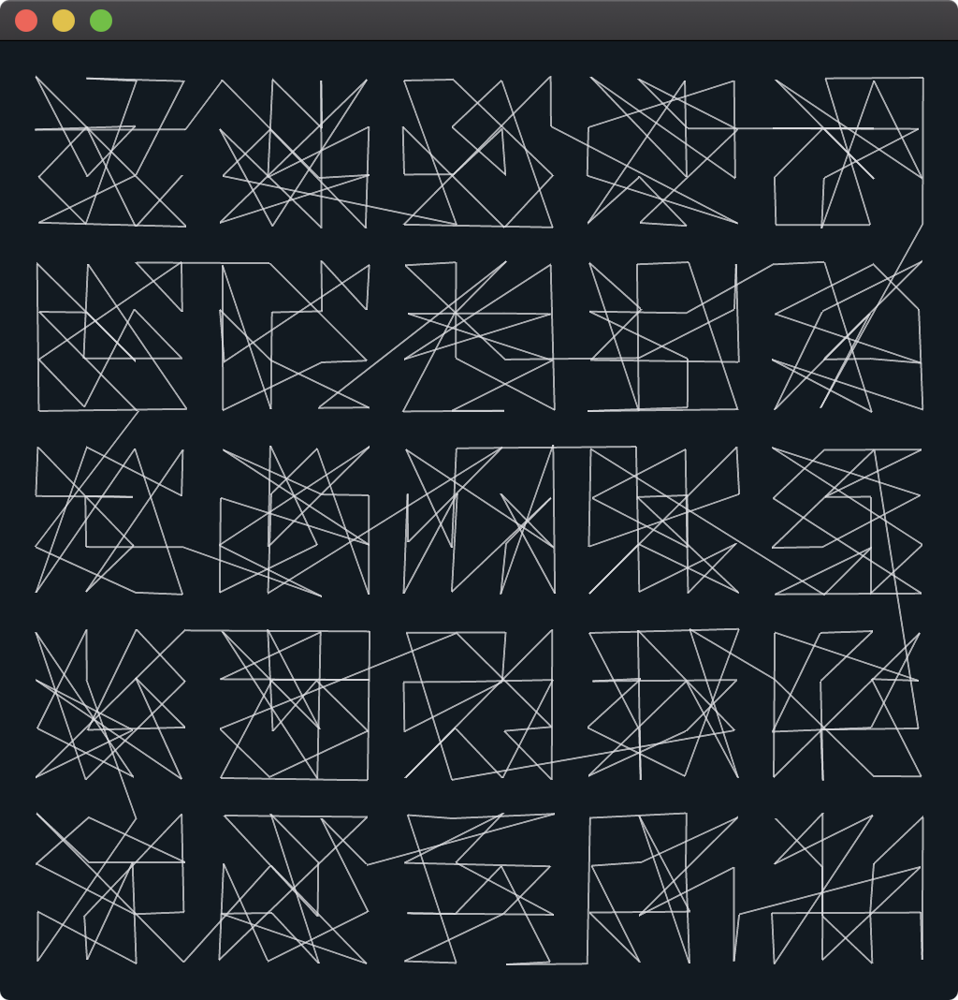
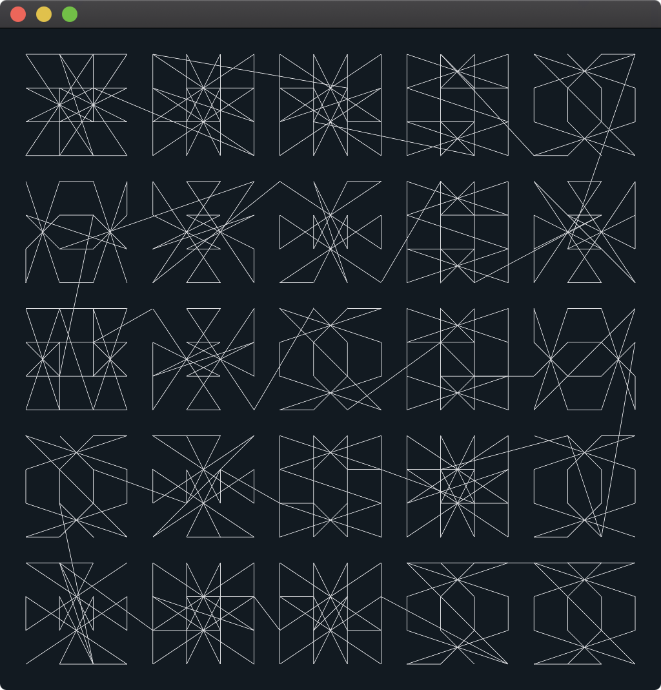
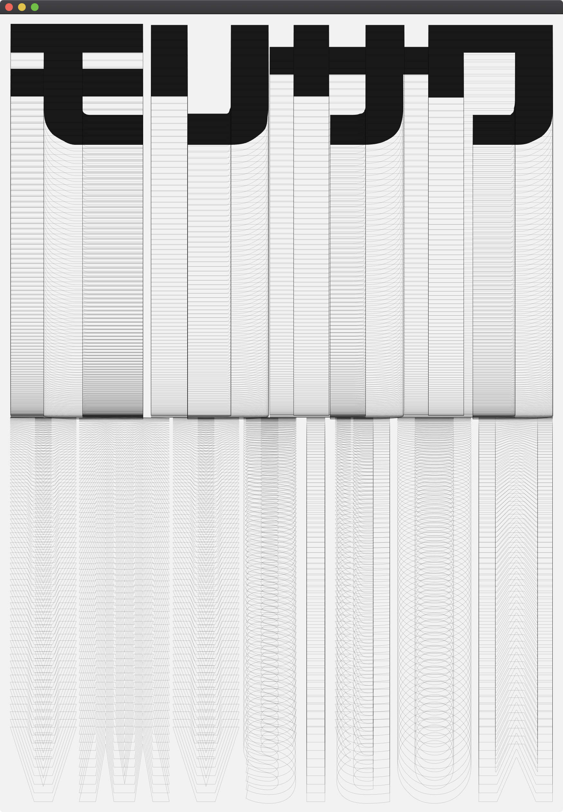

# sfpc-2020-rtp

Recreating the Past / SFPC Summer 2020

In [Recreating the Past](https://sfpc.io/recreatingthepast-spring2020/), we study computational art from the past decades and recreate these works with contemporary techniques to gain aesthetic, analytical and technical knowledge.

This repository contains my sketches and homework developed for the class.

<table cellpadding="0" cellspacing="20" border="0">
  <tr>
    <td>
      <a href="vera-molnar-01">
         
        vera-molnar-01
      </a>
    </td>
    <td>
      <a href="vera-molnar-02">
         
        vera-molnar-02
      </a>
    </td>
    <td>
      <a href="john-whitney-01">
         
        john-whitney-01
      </a>
    </td>
    <td>
      <a href="john-maeda-01">
         
        john-maeda-01
      </a>
    </td>
  </tr>
</table>

