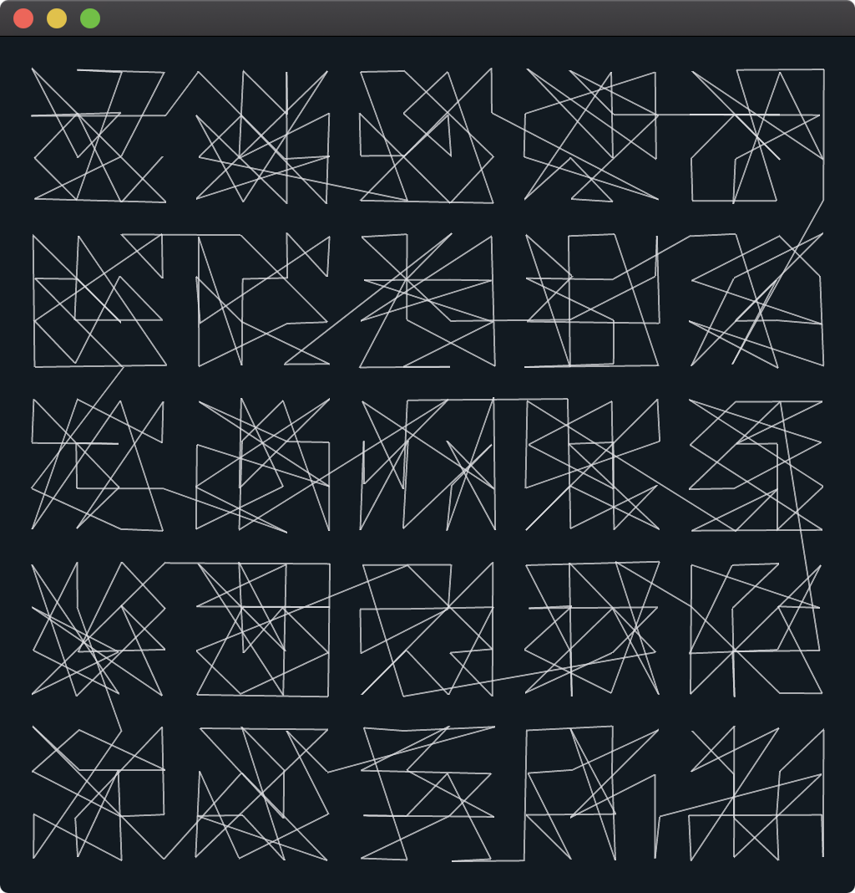
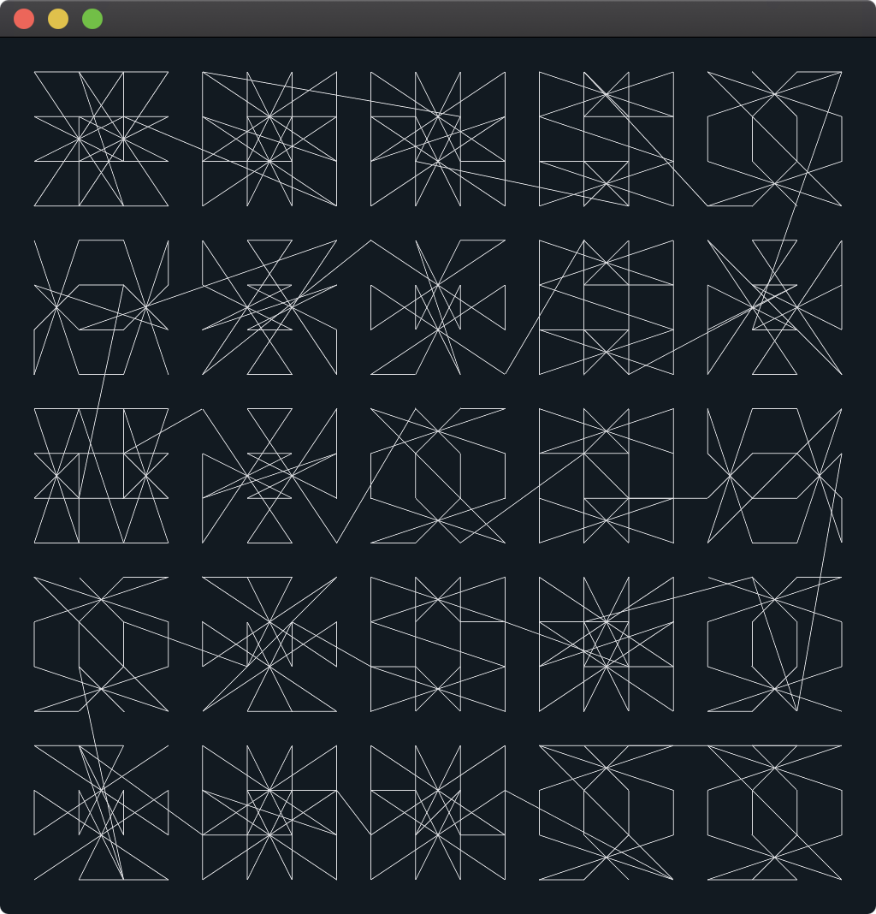

# sfpc-2020-rtp

Recreating the Past / SFPC Summer 2020

In [Recreating the Past](https://sfpc.io/recreatingthepast-spring2020/), we study computational art from the past decades and recreate these works with contemporary techniques to gain aesthetic, analytical and technical knowledge.

This repository contains my sketches and homework developed for the class.

## vera-molnar-01

A recreation of Vera Molnár's Hommage à Dürer (1990). 25 squares composed of 16 cells have the numbers 1 to 16 in random positions. A line is drawn from the top-left square passing cell by cell in numeric order. The line continues to the right, then goes to the below row, continues in oposite direction to the left. And so on. There's a small randomnization in the `x` and `y` coordinates to copy the effect of the physical threads used in the original piece.

## vera-molnar-02

When I first looked at this artwork I somehow assumed the squares were all magical squares (it's an homenage to [Dürer's Melencoly I](https://www.metmuseum.org/art/collection/search/336228) after all). I took the magical square in Melencoly I and then applied random transformations to get derivated magical squares. The end result ended up looking too "well-organized" and wasn't similar at all to Molnár's original work so I abandoned the idea of using magical squares. It looks great though, so I left the experiment here.

