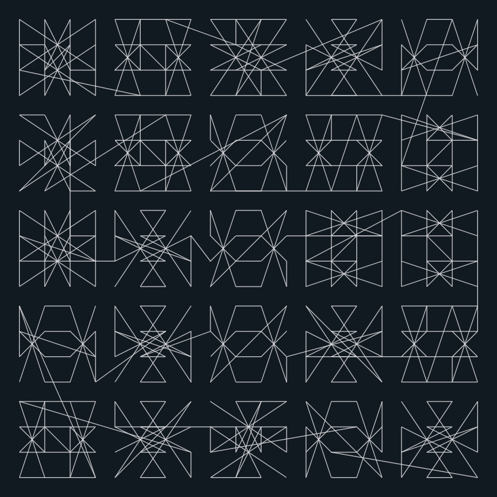

# vera-molnar-02

When I first looked at this artwork I somehow assumed the squares were all magical squares (it's an homenage to [Dürer's Melencoly I](https://www.metmuseum.org/art/collection/search/336228) after all). I took the magical square in Melencoly I and then applied random transformations to get derivated magical squares. The end result ended up looking too "well-organized" and wasn't similar at all to Molnár's original work so I abandoned the idea of using magical squares. It looks great though, so I left the experiment here.

